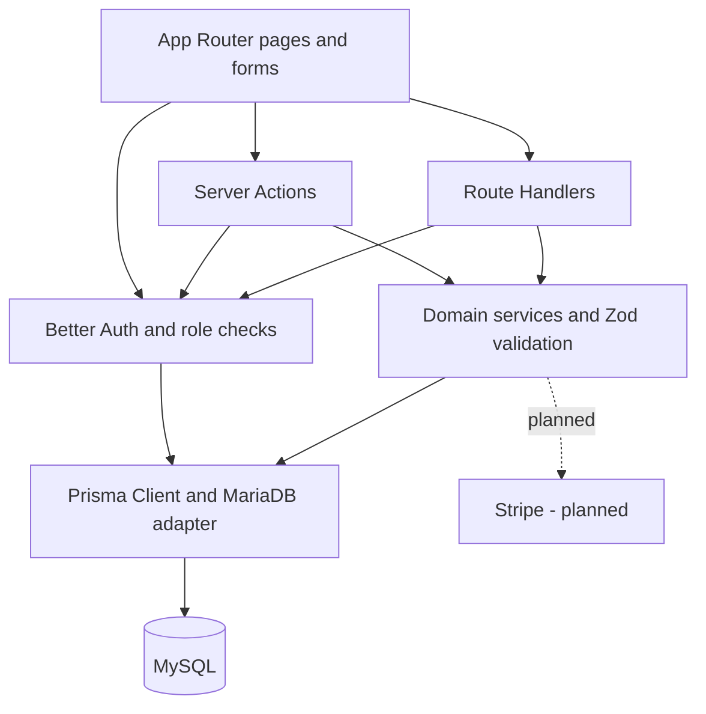

# Components Diagram

```mermaid
graph TD
    UI[App Router pages and forms]
    Actions[Server Actions]
    API[Route Handlers]
    Auth[Better Auth and role checks]
    Services[Domain services and Zod validation]
    Prisma[Prisma Client and MariaDB adapter]
    DB[(MySQL)]
    Stripe[Stripe - planned]

    UI --> Actions
    UI --> API
    UI --> Auth
    Actions --> Auth
    API --> Auth
    Actions --> Services
    API --> Services
    Auth --> Prisma
    Services --> Prisma
    Prisma --> DB
    Services -. planned .-> Stripe
```
