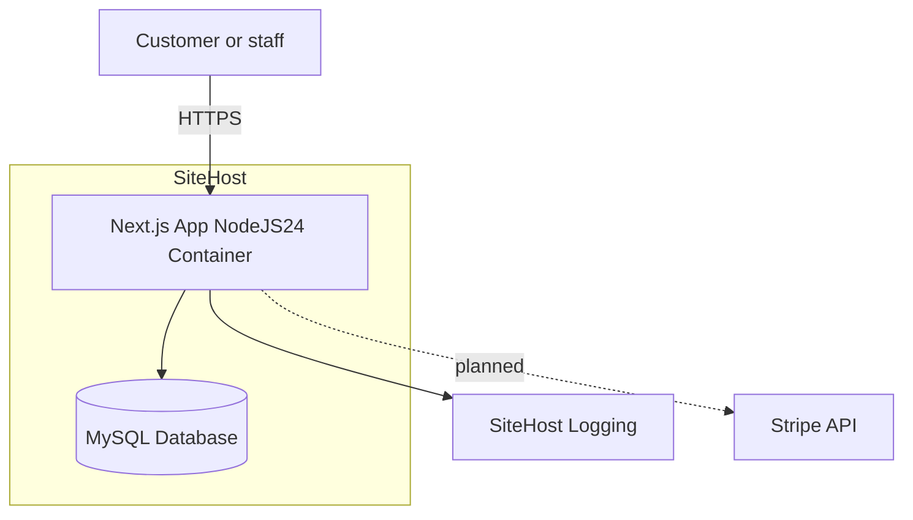

# Containers Diagram

```mermaid
graph TD
    User[Customer or staff] -->|HTTPS| App[Next.js App NodeJS24 Container]

    App --> DB[(MySQL Database)]
    App --> Logs[SiteHost Logging]
    App -. planned .-> StripeAPI[Stripe API]

    subgraph SiteHost
        App
        DB
    end
```
