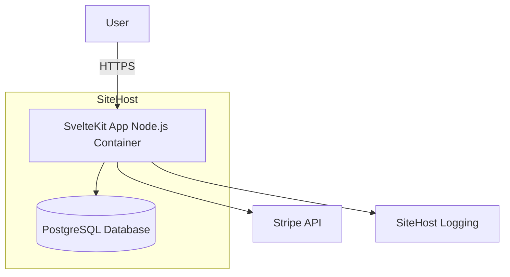

# Containers Diagram

```mermaid
graph TD
User -->|HTTPS| App[SvelteKit App Node.js Container]

    App --> DB[(PostgreSQL Database)]
    App --> StripeAPI[Stripe API]

    App --> Logs[SiteHost Logging]

    subgraph SiteHost
        App
        DB
    end
```
