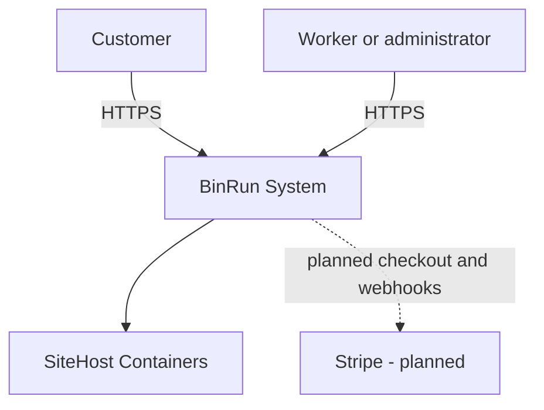

# System Context Diagram

This shows BinRun's current production context and its planned payment integration.

```mermaid
graph TD
    Customer[Customer]
    Staff[Worker or administrator]
    BinRun[BinRun System]
    Stripe[Stripe - planned]
    SiteHost[SiteHost Containers]

    Customer -->|HTTPS| BinRun
    Staff -->|HTTPS| BinRun
    BinRun --> SiteHost
    BinRun -. planned checkout and webhooks .-> Stripe
```
