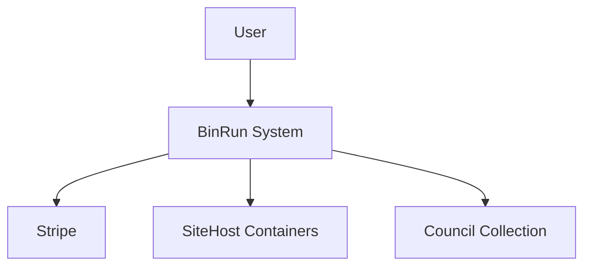

# System Context Diagram

This shows how BinRun interacts with external systems.

```mermaid
graph TD
    User[User]
    BinRun[BinRun System]
    Stripe[Stripe]
    SiteHost[SiteHost Containers]
    Council[Council Collection]

    User --> BinRun
    BinRun --> Stripe
    BinRun --> SiteHost
    BinRun --> Council
```
