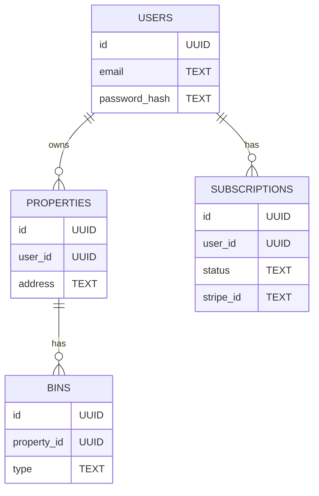

# Data Model

```mermaid
erDiagram
USERS {
id UUID
email TEXT
password_hash TEXT
}

    PROPERTIES {
        id UUID
        user_id UUID
        address TEXT
    }

    BINS {
        id UUID
        property_id UUID
        type TEXT
    }

    SUBSCRIPTIONS {
        id UUID
        user_id UUID
        status TEXT
        stripe_id TEXT
    }

    USERS ||--o{ PROPERTIES : owns
    PROPERTIES ||--o{ BINS : has
    USERS ||--o{ SUBSCRIPTIONS : has
```
