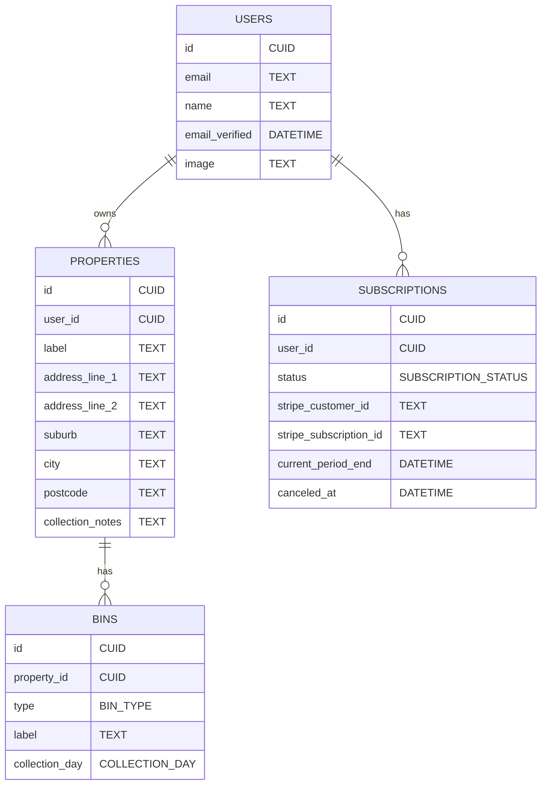

# Data Model

`BIN_TYPE` values are `RECYCLING_BINS`, `RUBBISH_WHEELIE`, and
`GREEN_WASTE_WHEELIE`. Red and blue recycling bins are modeled as one service
item because they go out together.

```mermaid
erDiagram
USERS {
id CUID
email TEXT
name TEXT
email_verified DATETIME
image TEXT
}

    PROPERTIES {
        id CUID
        user_id CUID
        label TEXT
        address_line_1 TEXT
        address_line_2 TEXT
        suburb TEXT
        city TEXT
        postcode TEXT
        collection_notes TEXT
    }

    BINS {
        id CUID
        property_id CUID
        type BIN_TYPE
        label TEXT
        collection_day COLLECTION_DAY
    }

    SUBSCRIPTIONS {
        id CUID
        user_id CUID
        status SUBSCRIPTION_STATUS
        stripe_customer_id TEXT
        stripe_subscription_id TEXT
        current_period_end DATETIME
        canceled_at DATETIME
    }

    USERS ||--o{ PROPERTIES : owns
    PROPERTIES ||--o{ BINS : has
    USERS ||--o{ SUBSCRIPTIONS : has
```
